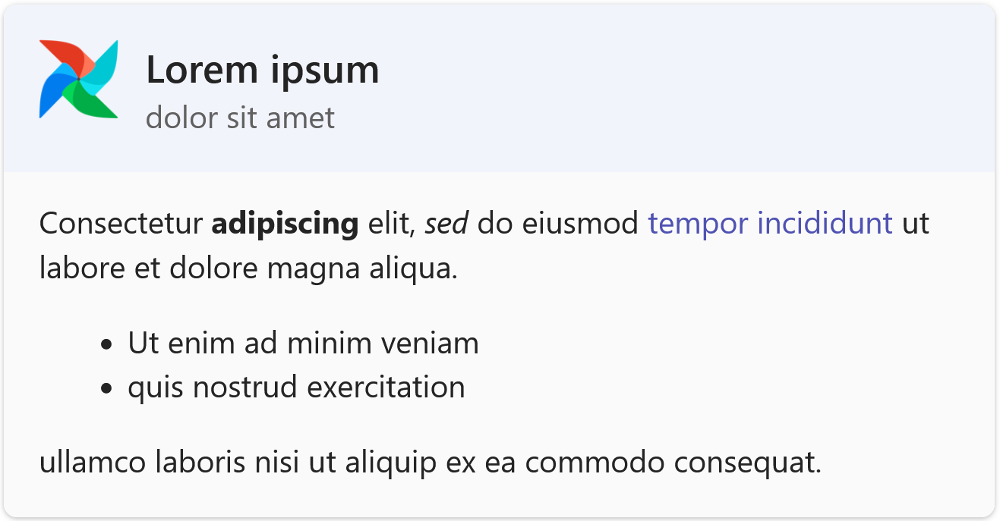
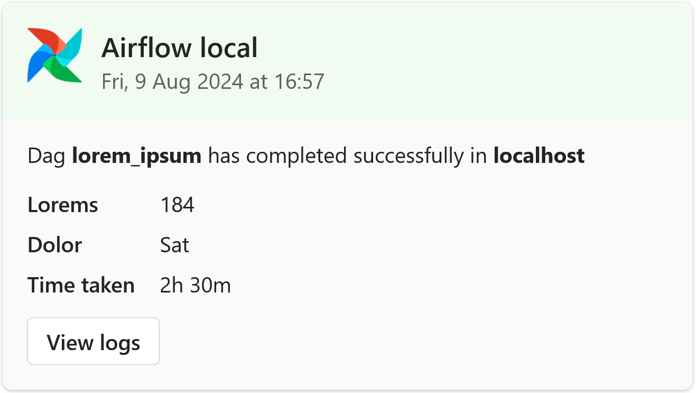
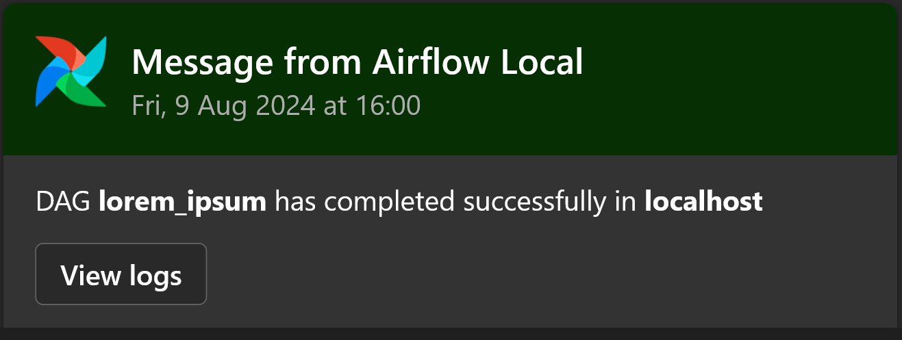

Airflow operator that can send messages to MS Teams. It has a few options to customize the card.

This is an Airflow operator that can send cards to MS Teams via webhooks. There are various options to customize the appearance of the cards. 

## Screenshots


| Header, subtitle, and body                                       | Header, subtitle, body, facts, and a button                                |
| ---------------------------------------------------------------- | -------------------------------------------------------------------------- |
|  |  |

 | Body with coloured text and coloured button                           | Coloured header, body, button, in dark mode                  |
 | --------------------------------------------------------------------- | ------------------------------------------------------------ |
 |  |  |


## Setup

You will need a webhook of course. The Webhook needs to be of the PowerAutomate type, not the Incoming Webhook type. Currently this is done either through the 'workflows' app in Teams, or via [PowerAutomate](https://powerautomate.com). 

Once that's ready, create an HTTP Connection in Airflow with the Webhook URL. 

* Conn Type: HTTP
* Host: The URL without the https://
* Schema: https

Finally, copy the [ms_teams_power_automate_webhook_operator.py](./ms_teams_powerautomate_webhook_operator.py) file into your Airflow dags folder and `import` it in your DAG code.

## Usage

The usage can be very basic from just a message, to a full card with header, subtitle, body, facts, and a button. There are some style options too. 

A very basic message:

```python
 op1 = MSTeamsPowerAutomateWebhookOperator(
        task_id="send_to_teams",
        http_conn_id="msteams_webhook_url",
        body_message="DAG **lorem_ipsum** has completed successfully in **localhost**",
    )
```

Add a button:
    
```python
op1 = MSTeamsPowerAutomateWebhookOperator(
        task_id="send_to_teams",
        http_conn_id="msteams_webhook_url",
        body_message="DAG **lorem_ipsum** has completed successfully in **localhost**",
        button_text="View Logs",
        button_url="https://example.com",
    )
```

Add a heading and subtitle:

```python
op1 = MSTeamsPowerAutomateWebhookOperator(
        task_id="send_to_teams",
        http_conn_id="msteams_webhook_url",
        heading_title="DAG **lorem_ipsum** has completed successfully",
        heading_subtitle="In **localhost**",
        body_message="DAG **lorem_ipsum** has completed successfully in **localhost**",
        button_text="View Logs",
        button_url="https://example.com",
    )
```

Add some colouring — header bar colour, subtle subtitle, body text colour, button colour:

```python
op1 = MSTeamsPowerAutomateWebhookOperator(
        task_id="send_to_teams",
        http_conn_id="msteams_webhook_url",
        header_bar_style="good",
        heading_title="DAG **lorem_ipsum** has completed successfully",
        heading_subtitle="In **localhost**",
        heading_subtitle_subtle=False,
        body_message="DAG **lorem_ipsum** has completed successfully in **localhost**",
        body_message_color_type="good",
        button_text="View Logs",
        button_url="https://example.com",
        button_style="positive",
    )
```

You can also look at [sample_dag.py](./sample_dag.py) for an example of how to use this operator in a DAG.


## Parameters

Here are all the parameters that can be set.

| Parameter               | Values                                                               | Notes                                                                     |
| ----------------------- | -------------------------------------------------------------------- | ------------------------------------------------------------------------- |
| http_conn_id            | The connection ID, eg "msteams_webhook_url"                          |                                                                           |
| card_width_full         | True(default) or False                                               | If false, the card will be the MSTeams default.                           |
| header_bar_show         | True(default) or False                                               | If false, heading title, subtitle, logo won't be shown.                   |
| header_bar_style        | `default`, `emphasis`, `good`, `attention`, `warning`, `accent`      | [docs - style](https://adaptivecards.io/explorer/Container.html)          |
| heading_title           |                                                                      | If not set, header bar won't be shown                                     |
| heading_title_size      | `default`, `small`, `medium`, `large`, `extraLarge`                  | [docs - size](https://adaptivecards.io/explorer/TextBlock.html)           |
| heading_subtitle        |                                                                      | Appears just below the title                                              |
| heading_subtitle_subtle | True(default) or False                                               | Subtle means toned down to appear less prominent                          |
| heading_show_logo       | True(default) or False                                               |                                                                           |
| body_message            |                                                                      | [Limited Markdown support](https://aka.ms/ACTextFeatures), no `monospace` |
| body_message_color_type | `default`, `dark`, `light`, `accent`, `good`, `warning`, `attention` | [docs - color](https://adaptivecards.io/explorer/TextBlock.html)          |
| body_facts_dict         | Example: {'aaa':'bbb','ccc':'ddd'}                                   | The key value pairs show up as facts in the card                          |
| button_text             | Example: "View Logs"                                                 | If not set, button won't be shown                                         |
| button_url              | Example: "https://example.com"                                       | For example, the URL to the Airflow log                                   |
| button_style            | `default`, `positive`, `destructive`                                 | [docs - style](https://adaptivecards.io/explorer/Action.OpenUrl.html)     |
| button_show             | True(default) or False                                               |                                                                           |


## Usage and Setup (Airflow, MS Teams)

For setup and usage instructions see [the writeup here](https://code.mendhak.com/Airflow-MS-Teams-Operator/)


## Testing this plugin locally for development

I've taken the docker compose yml from [here](https://airflow.apache.org/docs/apache-airflow/stable/howto/docker-compose/index.html), with a few changes. Load examples is false and added an extra_hosts.

Run this to prepare the environment:

```
mkdir -p ./dags ./logs ./plugins ./config
echo -e "AIRFLOW_UID=$(id -u)" > .env
docker compose up airflow-init
docker compose up
```

Then wait a bit, and open http://localhost:8080 with airflow:airflow. 

To create a connection quickly, use this CLI command

```
docker compose exec -it airflow-webserver airflow connections add 'msteams_webhook_url' --conn-json '{"conn_type": "http", "description": "", "host": "<url-goes-here-without https://>", "schema": "https", "login": "", "password": null, "port": null }'
```

Now run the sample_dag to see the operator in action. 

### Echoing requests

To troubleshoot the requests going out, use the included httpecho container which echoes the request to output.  
In Airflow connections, create an HTTP Connection to http://httpecho:8081 


```
docker compose exec -it airflow-webserver airflow connections add 'msteams_webhook_url' --conn-json '{"conn_type": "http", "description": "", "host": "httpecho:8081/a/b/c", "schema": "http", "login": "", "password": null, "port": null }'

docker compose logs -f httpecho
```

### Posting a card with curl

To manually post the sample card to a webhook URL, just for testing, use the included samplecard.json file.

```
curl -X POST -H 'Content-Type: application/json' --data-binary @samplecard.json  "https://prod-11.westus.logic.azure.com:443/workflows/.............."
```

## Contribute

Any simple feature requests, please fork and submit a PR. 


## License

Apache 2.0 (see code file headers) 